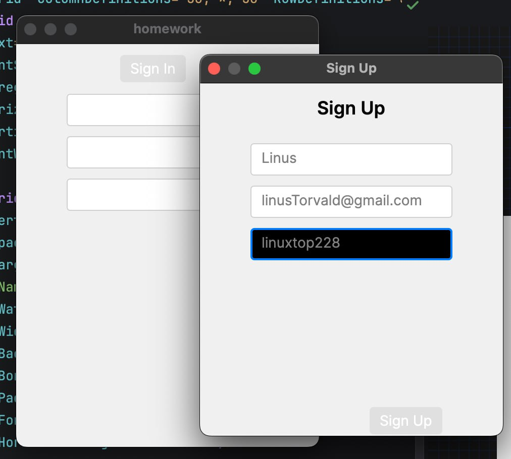
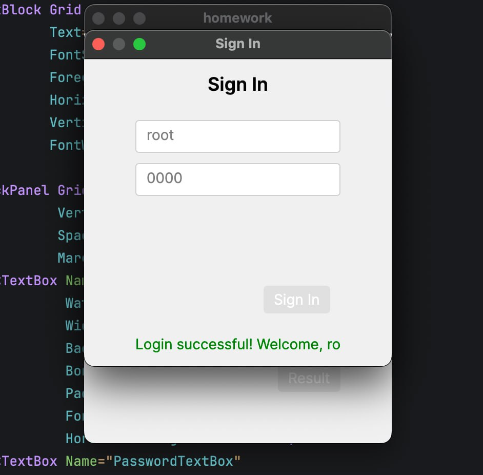
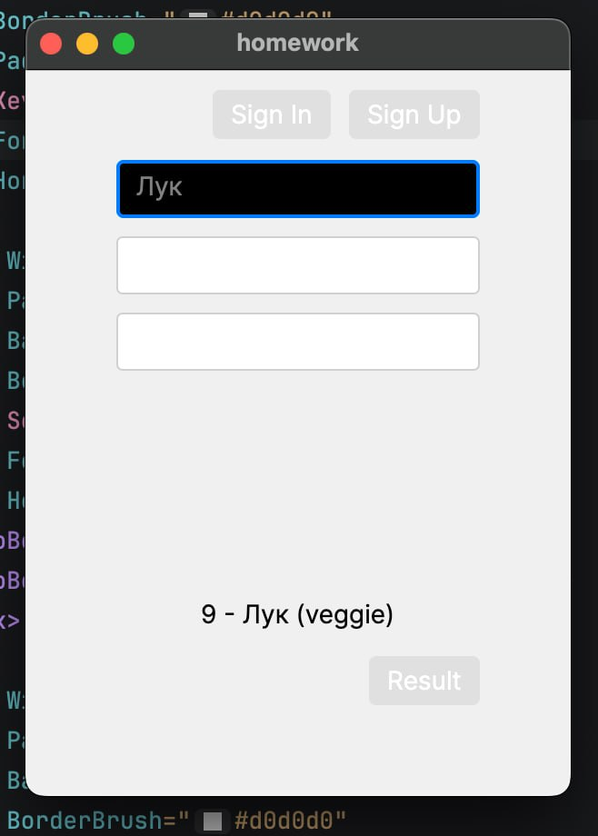
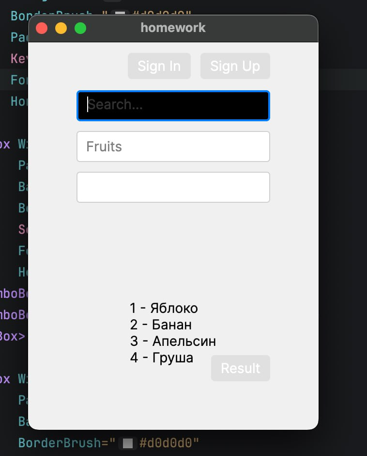
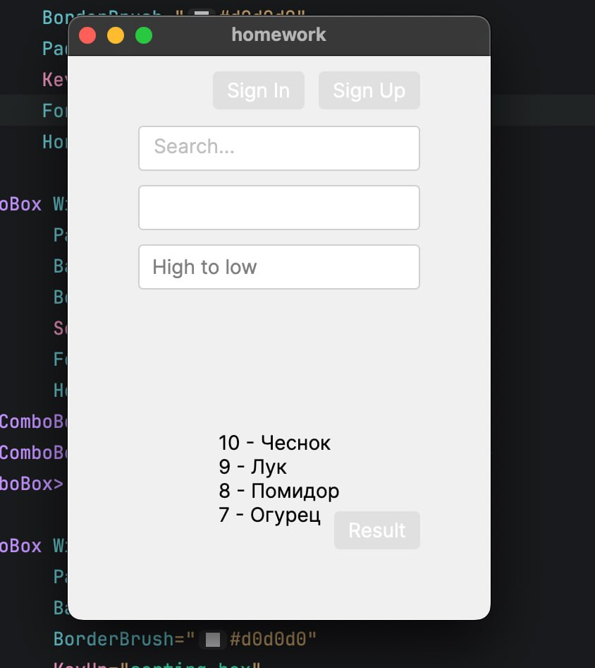
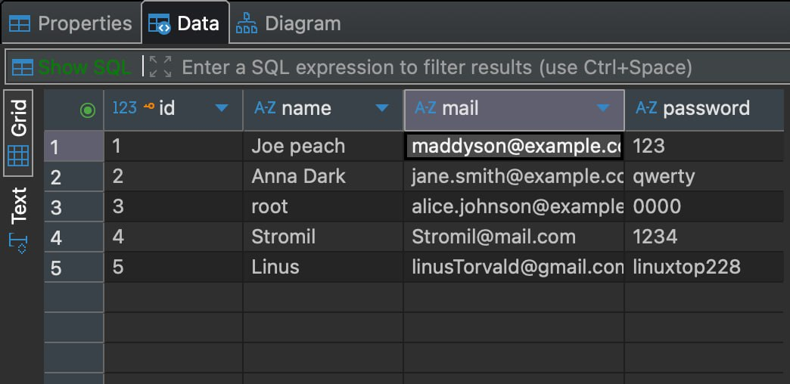
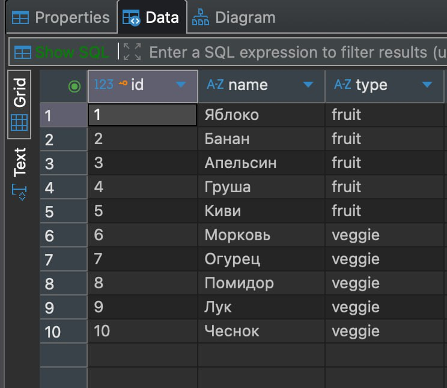

  

    <h2> Окно регистрации</h2>
    
    
Окно преверяет на длину символов в окне password  так же проверяет на наличие @ в строке mail .

  

  

    <h2 >Окно аутентификации</h2>
    
    
в строке mail/name можно написать одно из двух в коде будут сравниваться с двумя столбами в базе. 

  

  

    <h2 >Основное окно</h2>
    
    
Поиск

  

  

    
    
Фильтрация по фруктам и овощам

  

  

    
    
Сортировка по id от 1 до 10 и наоборот

  

  

    
    
Таблицы user

  

  

    
    
Таблица products

  

